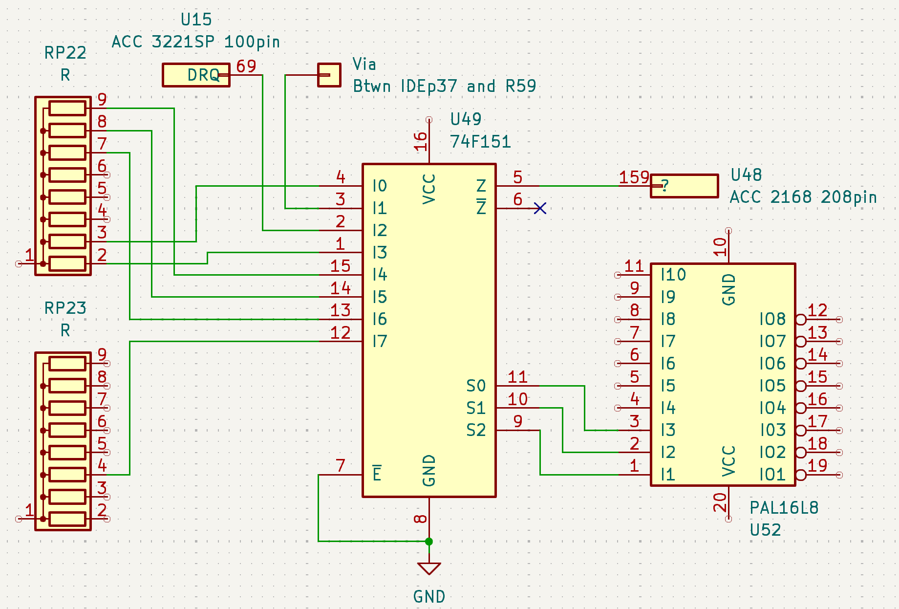

# pb410-74f151

This is a KiCad schematic showing components connected to the 74F151 at U49 on
the Packard Bell PB410 motherboard. There is no board layout, nor can it be
built.

This is the result of tracing out pins to verify that the traces connected to
this chip are connected properly. This chip is right next to a battery fixed to
the motherboard, and is the first thing to go when the battery inevitably
decides to leak. The symptoms on my board were:

1. Sped up digitized sound of a Sound Blaster card
2. Non-functional ethernet out of an ISA ethernet card
3. Random pauses and dropouts of video and sound while playing ROTT

Turned out some to none of the interrupt and DMA responses were functional due
to trace damage underneath the board, requiring a little bit of bodge work.

Hopefully this can be useful to someone else.
